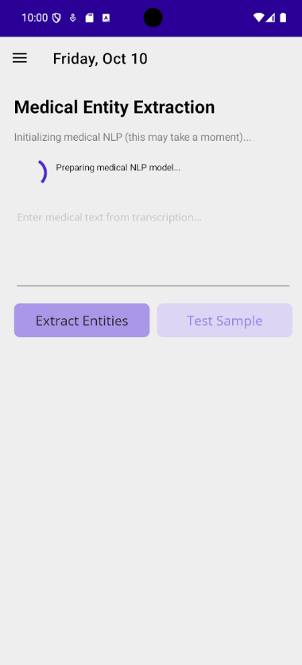
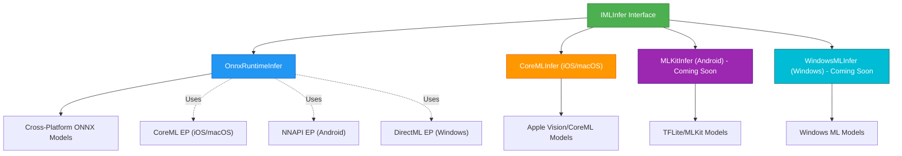

# Plugin.Maui.ML

A comprehensive .NET MAUI plugin that provides ML inference capabilities with support for multiple backends including ONNX Runtime, CoreML, and platform-native acceleration.



[](https://www.nuget.org/packages/Plugin.Maui.ML/)


## Architecture



**Legend:**
- **Green**: Unified interface for all backends
- **Blue**: ONNX Runtime (cross-platform, default)
- **Orange**: CoreML native (iOS/macOS only)
- **Purple**: ML Kit/TensorFlow Lite (Android - coming soon)
- **Cyan**: Windows ML (Windows - coming soon)
- **Dotted arrows**: Execution provider integration

## Features

- 🧠 **Multiple ML Backends**: ONNX Runtime, CoreML (iOS/macOS), ML Kit (Android - coming soon)
- 🏗️ **Platform-Specific Optimizations**: Leverages native ML acceleration on each platform
  - iOS/macOS: CoreML execution provider & Apple Neural Engine
  - Android: NNAPI execution provider
  - Windows: DirectML execution provider
- 📱 **Cross-Platform**: Supports Android, iOS, macOS Catalyst, and Windows
- 🔧 **Dependency Injection**: Easy integration with .NET DI container
- 🛠️ **Utility Classes**: Helper classes for tensor operations and model management
- 📦 **NuGet Package**: Available as a ready-to-use NuGet package
- 🔍 **Git LFS Support**: Proper handling of large ML model files
- 🧪 **Comprehensive Tests**: Full unit test coverage

## Installation

```xml
<PackageReference Include="Plugin.Maui.ML" Version="1.0.0" />
```

## Quick Start

### 1. Register the Service

```csharp
// In your MauiProgram.cs
public static class MauiProgram
{
    public static MauiApp CreateMauiApp()
    {
        var builder = MauiApp.CreateBuilder();
        builder
            .UseMauiApp<App>()
            .ConfigureFonts(fonts =>
            {
                fonts.AddFont("OpenSans-Regular.ttf", "OpenSansRegular");
            });

        // Register ML services with platform-optimized defaults
        builder.Services.AddMauiML(config =>
        {
            config.EnablePerformanceLogging = true;
            config.MaxConcurrentInferences = 2;
        });

        // Or specify a backend explicitly
        // builder.Services.AddMauiML(MLBackend.CoreML); // iOS/macOS only

        return builder.Build();
    }
}
```

### 2. Use in Your Code

```csharp
public class MainPage : ContentPage
{
    private readonly IMLInfer _mlService;

    public MainPage(IMLInfer mlService)
    {
        _mlService = mlService;
        InitializeComponent();
    }

    private async void OnPredictClicked(object sender, EventArgs e)
    {
        try
        {
            // Check which backend is being used
            Console.WriteLine($"Using backend: {_mlService.Backend}");

            // Load your model (ONNX or platform-specific format)
            await _mlService.LoadModelFromAssetAsync("my-model.onnx");

            // Prepare input tensors
            var inputData = new float[] { 1.0f, 2.0f, 3.0f, 4.0f };
            var inputTensor = TensorHelper.CreateTensor(inputData, new int[] { 1, 4 });
            var inputs = new Dictionary<string, Tensor<float>>
            {
                ["input"] = inputTensor
            };

            // Run inference
            var results = await _mlService.RunInferenceAsync(inputs);

            // Process results
            foreach (var output in results)
            {
                var outputData = TensorHelper.ToArray(output.Value);
                Console.WriteLine($"Output '{output.Key}': [{string.Join(", ", outputData)}]");
            }
        }
        catch (Exception ex)
        {
            await DisplayAlert("Error", ex.Message, "OK");
        }
    }
}
```

## Getting ONNX Models

Before using Plugin.Maui.ML, you'll need ONNX model files. You can:

1. **Download pre-converted ONNX models** from Hugging Face Model Hub
2. **Convert existing models** (PyTorch, TensorFlow, etc.) to ONNX format

We provide the **HFOnnxTool** to make this easy:

```bash
# Download a model that already has ONNX files
cd tools/HFOnnxTool
dotnet run -- fetch --repo sentence-transformers/all-MiniLM-L6-v2 --output ./models

# Or convert a model to ONNX format
dotnet run -- convert --repo d4data/biomedical-ner-all --task token-classification --output ./onnx
```

📖 **See the [HFOnnxTool Guide](docs/HFONNX_TOOL_GUIDE.md) for detailed instructions on:**
- Using the `inspect`, `fetch`, and `convert` commands
- Working with specific models like biomedical NER and sentence transformers
- Python setup for model conversion
- Troubleshooting common issues

## Backend Support

### Available Backends

| Backend | Platforms | Status | Hardware Acceleration |
|---------|-----------|--------|----------------------|
| **ONNX Runtime** | All | ✅ Stable | CoreML (iOS/macOS), NNAPI (Android), DirectML (Windows) |
| **CoreML** | iOS/macOS | ✅ Stable | Apple Neural Engine (A12+, M1+) |
| **ML Kit** | Android | 🚧 Coming Soon | NNAPI, GPU delegates |
| **Windows ML** | Windows | 🚧 Coming Soon | DirectML, DirectX 12 |

### Backend Selection

```csharp
// Automatic platform-optimized selection (recommended)
builder.Services.AddMauiML();

// Explicit backend
builder.Services.AddMauiML(MLBackend.CoreML); // iOS/macOS only

// Configuration-based
builder.Services.AddMauiML(config =>
{
    config.PreferredBackend = MLBackend.CoreML; // Falls back to default if not available
});

// Runtime selection
IMLInfer onnxInfer = new OnnxRuntimeInfer();
#if IOS || MACCATALYST
IMLInfer coreMLInfer = new CoreMLInfer();
#endif
```

### Model Format Support

| Backend | Formats | Notes |
|---------|---------|-------|
| ONNX Runtime | `.onnx` | Cross-platform, largest model zoo |
| CoreML | `.mlmodel`, `.mlmodelc` | Native iOS/macOS format |
| ML Kit | `.tflite` | Android-optimized |

See [Platform Backend Documentation](docs/PLATFORM_BACKENDS.md) for detailed information about backends, model conversion, and performance optimization.

## API Reference

### IMLInfer Interface

The main interface for ML inference operations.

#### Properties

- `MLBackend Backend { get; }` - Get the current backend type
- `bool IsModelLoaded { get; }` - Check if a model is currently loaded

#### Methods

- `Task LoadModelAsync(string modelPath, CancellationToken cancellationToken = default)`
  - Load a model from a file path

- `Task LoadModelAsync(Stream modelStream, CancellationToken cancellationToken = default)`  
  - Load a model from a stream

- `Task LoadModelFromAssetAsync(string assetName, CancellationToken cancellationToken = default)`
  - Load a model from MAUI assets

- `Task<Dictionary<string, Tensor<float>>> RunInferenceAsync(Dictionary<string, Tensor<float>> inputs, CancellationToken cancellationToken = default)`
  - Run inference with float inputs

- `Task<Dictionary<string, Tensor<float>>> RunInferenceLongInputsAsync(Dictionary<string, Tensor<long>> inputs, CancellationToken cancellationToken = default)`
  - Run inference with Int64 inputs (e.g., token IDs)

- `Dictionary<string, NodeMetadata> GetInputMetadata()`
  - Get input metadata for the loaded model

- `Dictionary<string, NodeMetadata> GetOutputMetadata()`
  - Get output metadata for the loaded model

- `void UnloadModel()`
  - Dispose of the loaded model and release resources

### TensorHelper Utility Class

Helper utilities for working with tensors.

#### Methods

- `static Tensor<float> CreateTensor(float[] data, int[] dimensions)`
  - Create a tensor from a float array

- `static Tensor<float> CreateTensor(float[,] data)`
  - Create a tensor from a 2D float array

- `static Tensor<float> CreateTensor(float[,,] data)`
  - Create a tensor from a 3D float array

- `static float[] ToArray(Tensor<float> tensor)`
  - Convert tensor to float array

- `static string GetShapeString(Tensor<float> tensor)`
  - Get tensor shape as a string

- `static Tensor<float> Reshape(Tensor<float> tensor, int[] newDimensions)`
  - Reshape a tensor to new dimensions

- `static Tensor<float> Normalize(Tensor<float> tensor)`
  - Normalize tensor values to 0-1 range

- `static Tensor<float> Softmax(Tensor<float> tensor)`
  - Apply softmax function to tensor

### Configuration

Configure the ML services with `MLConfiguration`:

```csharp
builder.Services.AddMauiML(config =>
{
    config.UseTransientService = false; // Use singleton (default)
    config.EnablePerformanceLogging = true;
    config.MaxConcurrentInferences = Environment.ProcessorCount;
    config.DefaultModelAssetPath = "models/default-model.onnx";
    config.PreferredBackend = MLBackend.CoreML; // Optional: specify preferred backend
});
```

#### Configuration Options

- `PreferredBackend`: Preferred ML backend (default: null = platform default)
- `UseTransientService`: Whether to use transient service lifetime (default: false, uses singleton)
- `EnablePerformanceLogging`: Enable performance logging (default: false)  
- `MaxConcurrentInferences`: Maximum number of concurrent inference operations (default: processor count)
- `DefaultModelAssetPath`: Default model asset path (default: null)

## Platform-Specific Features

### Android
- **NNAPI Support**: Automatic Neural Network API acceleration on supported devices (Android 8.1+)
- **Asset Loading**: Load models directly from Android assets folder
- **Check Capabilities**: `PlatformMLInfer.IsNnapiAvailable()`

### iOS/macOS
- **CoreML Integration**: Automatic CoreML acceleration via ONNX Runtime
- **Pure CoreML Support**: Use native `.mlmodel` files with `CoreMLInfer`
- **Neural Engine**: Support for Apple Neural Engine on A12+ and M1+ chips
- **Bundle Resources**: Load models from iOS/macOS app bundles
- **Check Capabilities**: `PlatformMLInfer.IsNeuralEngineAvailable()`

### Windows
- **DirectML Support**: Hardware acceleration via DirectML on compatible GPUs
- **Package Resources**: Load models from Windows app packages
- **Check Capabilities**: `PlatformMLInfer.IsDirectX12Available()`, `PlatformMLInfer.GetSystemInfo()`

## Examples

Check out the sample projects in the `samples/` directory:

- **ConsoleApp**: Basic console application demonstrating plugin usage
- **MauiSample**: Full MAUI app with UI examples
- Comprehensive examples showing different model types and backends

## Testing

Run the comprehensive test suite:

```bash
dotnet test tests/Plugin.Maui.ML.Tests/
```

The test suite includes:
- Unit tests for all core functionality
- Backend-specific tests
- Platform-specific integration tests
- Performance benchmarks
- Memory leak detection

## Performance Considerations

- **Use singleton service lifetime** for better performance (default)
- **Backend Selection**: 
  - ONNX Runtime: Best for cross-platform compatibility
  - CoreML: Best for iOS/macOS-only apps needing maximum performance
- **Hardware Acceleration**: Automatically enabled on all platforms
- **Memory Management**: Use `UnloadModel()` when done with a model
- **Async Operations**: All inference operations are async to avoid blocking UI

### Performance Tips

```csharp
// Check backend capabilities
#if IOS
if (Platforms.iOS.PlatformMLInfer.IsNeuralEngineAvailable())
{
    Console.WriteLine("Running on Apple Neural Engine!");
}
#endif

// Profile inference time
var sw = Stopwatch.StartNew();
var result = await _mlService.RunInferenceAsync(inputs);
sw.Stop();
Console.WriteLine($"Inference took: {sw.ElapsedMilliseconds}ms");
```

## Documentation

- [Platform Backend Guide](docs/PLATFORM_BACKENDS.md) - Detailed guide on backends and model conversion
- [HFOnnxTool Guide](docs/HFONNX_TOOL_GUIDE.md) - Guide for downloading and converting Hugging Face models to ONNX
- [API Reference](#api-reference) - Complete API documentation
- [Examples](samples/) - Sample code and applications

## Troubleshooting

### Common Issues

1. **Model Loading Errors**
   - Ensure the model file path is correct
   - Verify the model format matches the backend (ONNX for OnnxRuntime, .mlmodel for CoreML)
   - Check file permissions

2. **Backend Not Available**
   - Some backends are platform-specific
   - Check `_mlService.Backend` to see what's being used
   - Use `MLPlugin.Default` for automatic platform selection

3. **Memory Issues**
   - Use `UnloadModel()` when done with a model
   - Consider using transient services for memory-sensitive scenarios
   - Monitor memory usage with large models

4. **Platform-Specific Issues**
   - iOS: Ensure CoreML execution provider is available (iOS 11+)
   - Android: Check NNAPI availability with `IsNnapiAvailable()`
   - Windows: Verify DirectML support with `IsDirectX12Available()`

## Contributing

We welcome contributions! Please see our [Contributing Guide](CONTRIBUTING.md) for details.

## License

This project is licensed under the MIT License - see the [LICENSE](LICENSE) file for details.

## Acknowledgments

- Built on top of [Microsoft ONNX Runtime](https://onnxruntime.ai/)
- CoreML support via Apple's Core ML framework
- Inspired by the .NET MAUI community plugins
- Thanks to all contributors and users
