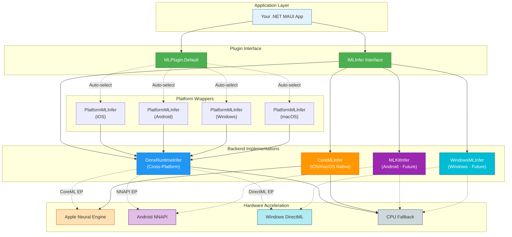
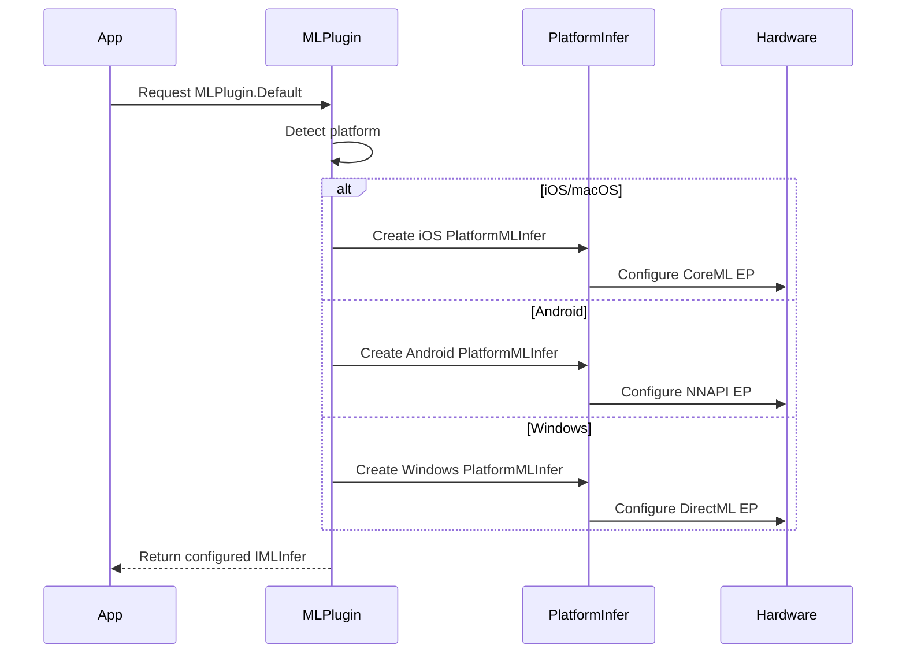
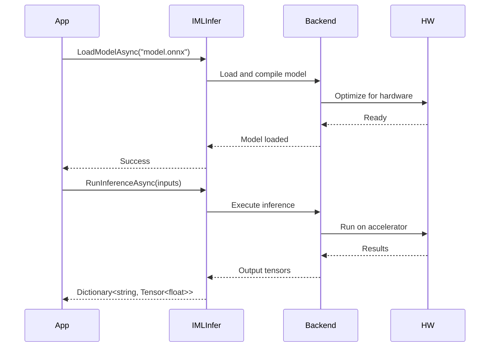
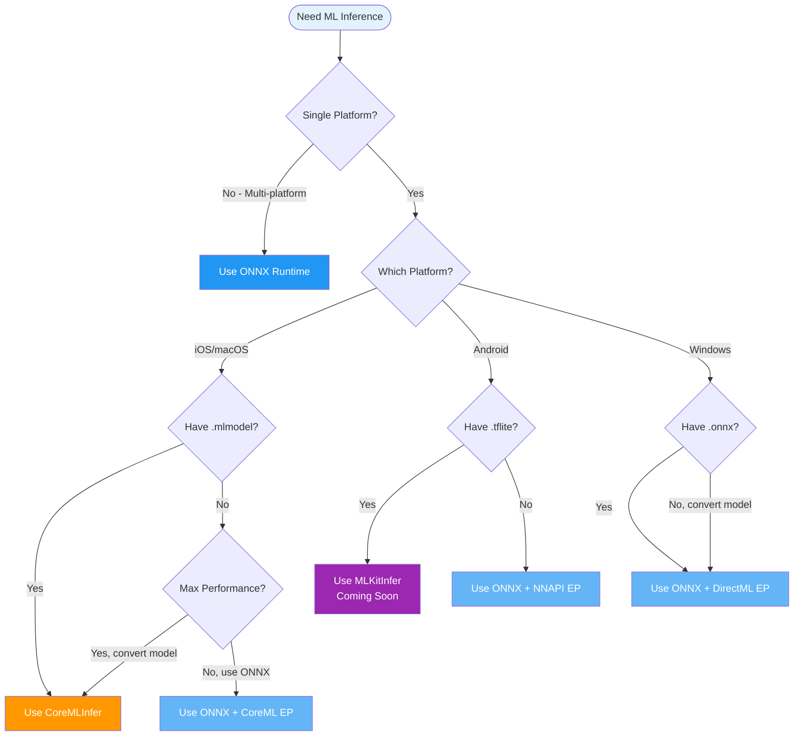

# Plugin.Maui.ML - Architecture Overview

## Visual Architecture



## Component Breakdown

### 1. Application Layer
Your .NET MAUI application that consumes the ML inference services.

```csharp
public class MyApp
{
    private readonly IMLInfer _mlService;
    
    public MyApp(IMLInfer mlService)
    {
        _mlService = mlService; // Injected by DI
    }
}
```

### 2. Plugin Interface Layer
Provides unified interface and automatic backend selection.

```csharp
// Interface
public interface IMLInfer
{
    MLBackend Backend { get; }
    Task<Dictionary<string, Tensor<float>>> RunInferenceAsync(...);
    // ...
}

// Auto-selection
var mlService = MLPlugin.Default; // Automatically picks best backend
```

### 3. Backend Implementations

#### ONNX Runtime (Default)
```csharp
public class OnnxRuntimeInfer : IMLInfer
{
    public MLBackend Backend => MLBackend.OnnxRuntime;
    // Uses ONNX format (.onnx files)
    // Works on all platforms
}
```

#### CoreML (iOS/macOS)
```csharp
public class CoreMLInfer : IMLInfer
{
    public MLBackend Backend => MLBackend.CoreML;
    // Uses CoreML format (.mlmodel, .mlmodelc)
    // iOS/macOS only
    // Direct Neural Engine access
}
```

### 4. Platform Wrappers
Provide platform-specific optimizations while using base implementations.

```csharp
// iOS Platform Wrapper
public class PlatformMLInfer : OnnxRuntimeInfer
{
    // Inherits ONNX Runtime
    // Adds CoreML execution provider
    // Provides iOS-specific helpers
    
    public static IMLInfer CreateCoreMLInfer()
    {
        return new CoreMLInfer(); // Factory for pure CoreML
    }
}
```

### 5. Hardware Acceleration

| Platform | Primary | Secondary | Fallback |
|----------|---------|-----------|----------|
| **iOS/macOS** | Neural Engine | CoreML | CPU |
| **Android** | NPU via NNAPI | GPU | CPU |
| **Windows** | GPU via DirectML | - | CPU |

## Data Flow Examples

### Example 1: Automatic Backend Selection


### Example 2: Inference Execution


## Backend Comparison Matrix

| Feature | ONNX Runtime | CoreML | ML Kit | Windows ML |
|---------|--------------|--------|--------|------------|
| **Cross-Platform** | ? Yes | ? No | ? No | ? No |
| **Model Format** | .onnx | .mlmodel | .tflite | .onnx |
| **Platforms** | All | iOS/macOS | Android | Windows |
| **Status** | ? Stable | ? Stable | ?? Planned | ?? Planned |
| **Hardware Accel** | All | Neural Engine | NNAPI | DirectML |
| **Model Zoo** | Huge | Medium | Large | Medium |
| **Conversion Tools** | Many | coremltools | tf2lite | tf2onnx |
| **Memory Usage** | Medium | Low | Medium | Medium |
| **Performance** | High | Highest* | High | High |

*When using Native CoreML on Apple Silicon

## Decision Tree: Which Backend to Use?



## Usage Patterns

### Pattern 1: Simple (Recommended for Most Apps)
```csharp
// MauiProgram.cs
builder.Services.AddMauiML(); // Auto-optimized for platform

// Your code
public MyViewModel(IMLInfer mlService)
{
    _mlService = mlService; // Works everywhere!
}
```

### Pattern 2: Platform-Specific Optimization
```csharp
#if IOS || MACCATALYST
builder.Services.AddMauiML(MLBackend.CoreML); // Native CoreML
#elif ANDROID
builder.Services.AddMauiML(MLBackend.OnnxRuntime); // ONNX + NNAPI
#else
builder.Services.AddMauiML(); // Default
#endif
```

### Pattern 3: Runtime Backend Selection
```csharp
public class AdvancedMLService
{
    private IMLInfer _fastBackend;
    private IMLInfer _accurateBackend;
    
    public AdvancedMLService()
    {
        // Fast backend for real-time
        _fastBackend = new OnnxRuntimeInfer();
        
#if IOS || MACCATALYST
        // Accurate backend for batch processing
        _accurateBackend = new CoreMLInfer();
#else
        _accurateBackend = _fastBackend;
#endif
    }
    
    public Task<T> ProcessRealtime<T>(byte[] data)
        => RunInference(_fastBackend, data);
    
    public Task<T> ProcessBatch<T>(byte[] data)
        => RunInference(_accurateBackend, data);
}
```

## Performance Characteristics

### Inference Speed Comparison (Relative)
```
Model: ResNet50, Input: 224x224x3, Device: iPhone 14 Pro

?????????????????????????????????????????
? Backend         ? Speed    ? Memory   ?
?????????????????????????????????????????
? CoreML (Native) ? ???????? ? ??       ? Fastest, lowest memory
? ONNX + CoreML   ? ???????  ? ???      ? Very fast, good memory
? ONNX CPU        ? ????     ? ????     ? Slower, higher memory
?????????????????????????????????????????
```

### Trade-offs

**ONNX Runtime:**
- ? Works everywhere (one model, all platforms)
- ? Huge model ecosystem (PyTorch, TensorFlow, etc.)
- ? Active development
- ?? Slightly larger app size
- ?? Conversion overhead (native ? ONNX ? native)

**CoreML Native:**
- ? Best performance on Apple devices
- ? Lowest memory footprint
- ? Direct Neural Engine access
- ? iOS/macOS only
- ? Requires model conversion
- ? Smaller model ecosystem

**ML Kit (Future):**
- ? Google's high-level APIs
- ? Pre-built models for common tasks
- ? Good Android optimization
- ? Android only
- ? Less flexibility than TFLite

## Migration Path

### From ONNX-Only ? Multi-Backend

**Phase 1: No Changes Required** ?
```csharp
// Existing code continues to work
var inferService = new OnnxRuntimeInfer();
```

**Phase 2: Opt-in to Platform Defaults** (Recommended)
```csharp
// Change registration
builder.Services.AddMauiML(); // Instead of AddSingleton<IMLInfer, OnnxRuntimeInfer>()

// Code stays the same
public MyService(IMLInfer mlService) { }
```

**Phase 3: Platform-Specific Optimization** (Optional)
```csharp
#if IOS || MACCATALYST
// Use pure CoreML for best performance
builder.Services.AddMauiML(MLBackend.CoreML);
// Convert your .onnx models to .mlmodel
#endif
```

## Summary

This architecture provides:

1. **Flexibility**: Choose backends based on your needs
2. **Performance**: Platform-native acceleration when available
3. **Compatibility**: ONNX fallback ensures it works everywhere
4. **Simplicity**: Unified interface regardless of backend
5. **Future-Proof**: Easy to add new backends without breaking changes

**Recommendation**: Start with `MLPlugin.Default` or `AddMauiML()` for automatic optimization. Only use specific backends when you have platform-specific models or performance requirements.
